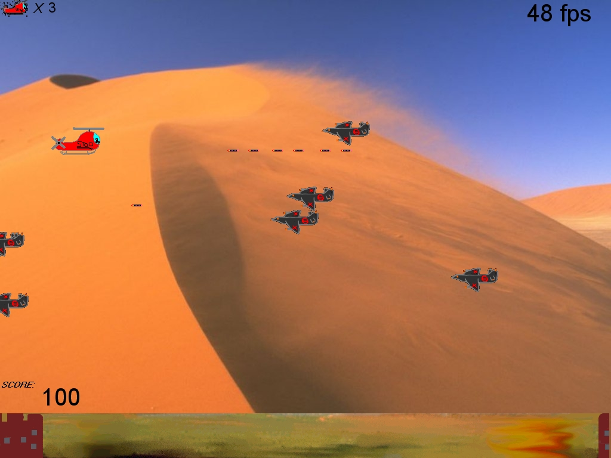



## Tricops Game \+ SCREENSHOT

### Description

Side scrolling shooter similar to R-Type, except you are a chopper!, shows use of bitblt to create fast flickerless animation, keyboard controlls, move and shoot at the enemy planes - good collision detection with sound!.I have now included an end of level boss!!, please let me know what you think of this, any feedback is welcome!
 
### More Info
 

             |
---                |---
**Submitted On**   |2003-04-26 15:58:06
**By**             |[Richard Stoddart](https://github.com/Planet-Source-Code/PSCIndex/blob/master/ByAuthor/richard-stoddart.md)
**Level**          |Intermediate
**User Rating**    |5.0 (10 globes from 2 users)
**Compatibility**  |VB 6\.0
**Category**       |[Games](https://github.com/Planet-Source-Code/PSCIndex/blob/master/ByCategory/games__1-38.md)
**World**          |[Visual Basic](https://github.com/Planet-Source-Code/PSCIndex/blob/master/ByWorld/visual-basic.md)
**Archive File**   |[Tricops1698121222004\.zip](https://github.com/Planet-Source-Code/richard-stoddart-tricops-game-screenshot__1-51180/archive/master.zip)

